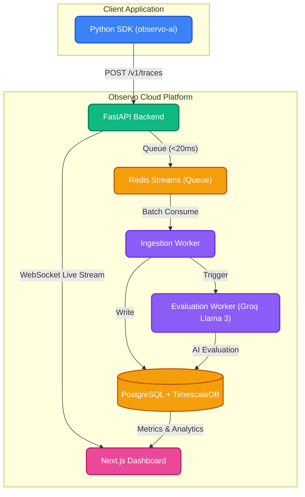

# 🛸 Observo — AI Observability & Evaluation Platform

<p align="center">
  <strong>Production-grade LLM observability, automated evaluation, and real-time monitoring.</strong>
</p>

<p align="center">
  <a href="https://observo.panditaman.com">Live Dashboard</a> ·
  <a href="#-quick-start">Getting Started</a> ·
  <a href="#-python-sdk-observo-ai">Python SDK</a> ·
  <a href="#-platform-workflows">Workflows</a>
</p>

---

## What is Observo?

Observo is a full-stack AI observability platform that lets you **trace every LLM call**, **detect hallucinations automatically**, **set alerts**, and **monitor performance** — all from a single, intuitive cloud dashboard. It is designed to be drop-in compatible with any Python AI application with zero-config auto-instrumentation.

---

## ✨ Features

| Feature | Description |
|---|---|
| 🔍 **Real-Time Tracing** | Capture every LLM call with input, output, latency, token counts, and cost. |
| 🤖 **Automated AI Evaluation** | Built-in hallucination, safety, and factual accuracy detection using Groq (Llama 3). |
| 📊 **Advanced Analytics** | Time-series charts for P50/P90/P99 latency, throughput, token usage, and costs. |
| 🚨 **Alerting Engine** | Rule-based alerting with email (SMTP) notifications for degradation or spikes. |
| 🏷️ **Annotations & Labs** | Label traces with ground truth, curate datasets, and run batch experiments. |
| 🎮 **Playground** | Test prompts live against your connected LLM providers. |
| 🔑 **API Key Management** | Per-project API keys with granular rate limiting and access controls. |
| 👥 **Multi-Tenant Workspaces** | Isolate data across multiple teams and projects securely. |
| ⚡ **Ultra-Low Latency** | Trace ingestion returns in < 20ms using an async Redis Streams queue. |
| 📡 **Live Streaming** | WebSocket connections push new traces to the dashboard instantly. |
| 🐍 **Python SDK** | Available on PyPI (`observo-ai`) with 1-line auto-instrumentation. |

---

## 🏗️ Architecture & Data Flow

Observo handles high-throughput trace ingestion asynchronously, ensuring that your AI application is never blocked by monitoring overhead.



---

## 🔄 Platform Workflows

### 1. Trace Ingestion Workflow
1. The **Python SDK** buffers traces in memory and flushes them in batches to minimize network overhead.
2. The **Observo API** receives the payload, validates the API key via middleware, and pushes the raw trace data to a **Redis Stream**. It returns a `202 Accepted` response in under 20ms.
3. The background **Ingestion Worker** consumes from the Redis Stream and bulk-inserts the traces into **PostgreSQL**.

### 2. Automated AI Evaluation Workflow
1. Once a trace is saved, it is flagged for evaluation.
2. The **Eval Worker** picks up pending traces and uses **Groq (Llama 3)** to score the interaction for hallucinations, toxicity, and factual accuracy.
3. For Pro/Enterprise tiers, a **Deep Audit** using Anthropic's Claude can be triggered for complex reasoning validations.
4. Scores and reasoning are attached to the trace and immediately visible on the dashboard.

### 3. Real-Time Alerting Workflow
1. The **APScheduler** runs every 60 seconds to evaluate user-defined alert rules against the latest TimescaleDB metrics.
2. If a metric (e.g., P90 Latency > 2000ms or Error Rate > 5%) breaches the threshold, an **Alert** is triggered.
3. An email notification is dispatched via SMTP to the project stakeholders.

---

## 🚀 Quick Start

Start monitoring your AI applications in minutes using our managed cloud platform.

### Step 1: Create an Account & Workspace
1. Go to **[observo.panditaman.com](https://observo.panditaman.com)**.
2. Sign up or log in securely.
3. Follow the onboarding prompt to create your **Organization** and your first **Project Workspace**.

### Step 2: Generate an API Key
1. Inside your new workspace, navigate to **Settings > API Keys**.
2. Click **Create Key**, give it a name (e.g., `Production`), and copy the generated key.
   *(It will look like `obs_live_...`)*

### Step 3: Install the SDK
Install the official Python SDK via PyPI:
```bash
pip install observo-ai
```

### Step 4: Instrument Your Code
Export your API key as an environment variable in your deployment environment:
```bash
export OBSERVO_API_KEY="obs_live_your_key_here"
export OBSERVO_API_URL="https://observo.panditaman.com" # Or your dedicated API URL
```

Then, initialize the SDK in your application startup:

```python
import observo

observo.init(
    api_key="obs_live_your_key_here", # Alternatively, rely on the OBSERVO_API_KEY env var
    environment="production"
)
```

---

## 🐍 Python SDK (`observo-ai`)

Observo provides multiple ways to instrument your code, from zero-touch auto-patching to granular manual logging.

### Option 1 — Zero-Touch (Recommended)
Run your app with the magic CLI wrapper. No code changes are needed—Observo automatically intercepts all OpenAI, Groq, and Anthropic calls.
```bash
observo-run main.py
```

### Option 2 — One-Line Auto-Instrumentation
Add a single import at the very top of your application entry point:
```python
import observo.auto  # Automatically patches LLM provider SDKs
```

### Option 3 — Decorator
Decorate your LLM wrapper functions to trace their inputs, outputs, and latency automatically.
```python
import observo

@observo.trace(model="gpt-4o", provider="openai")
def ask_llm(prompt: str) -> str:
    response = openai.chat.completions.create(
        model="gpt-4o",
        messages=[{"role": "user", "content": prompt}]
    )
    return response.choices[0].message.content

# Works natively with async and streaming generators!
@observo.trace(model="gpt-4o")
async def ask_gpt_async(prompt: str):
    ...
```

### Option 4 — Context Manager
Gain full manual control over the trace lifecycle, perfect for complex RAG pipelines.
```python
with observo.span("rag_pipeline") as span:
    context = retrieve_docs(question)
    answer = llm.generate(question, context)

    span.set_input(question)
    span.set_output(answer)
    span.set_ground_truth("Expected perfect answer")  # Enables factual accuracy eval
    span.set_metadata(model="gpt-4o", cost_usd=0.002, user_id="u123")
```

### Option 5 — Manual Log
Log a completed interaction directly without wrappers.
```python
observo.log(
    input="What is the capital of France?",
    output="The capital of France is Paris.",
    model="gpt-4o",
    provider="openai",
    latency_ms=320,
    input_tokens=15,
    output_tokens=10
)
```

---

## 📡 API Reference Overview

Observo's API is fully documented via OpenAPI. Once logged in, you can view the interactive Swagger UI at `/docs` on the API domain.

**Base URL:** `https://observo.panditaman.com/api` (or your dedicated API URL)
**Authentication:** `Authorization: Bearer obs_live_<your_key>`

### Key Endpoints
| Category | Endpoint | Description |
|---|---|---|
| **Traces** | `POST /v1/traces` | Ingest a single trace asynchronously. |
| **Traces** | `POST /v1/traces/batch` | Bulk ingest up to 100 traces. |
| **Analytics** | `GET /v1/traces/stats` | Retrieve aggregated costs, token counts, and volume. |
| **Analytics** | `GET /v1/traces/timeseries` | Fetch 5-minute bucketed latency and throughput data. |
| **Projects** | `GET /v1/projects` | List workspaces you have access to. |
| **Keys** | `POST /v1/projects/{id}/keys` | Programmatically provision new API keys. |
| **Alerts** | `POST /v1/alert-rules` | Define a new alerting threshold. |
| **Lab** | `POST /v1/lab/experiments` | Trigger a batch evaluation experiment. |

---

## 📄 License

This project is licensed under the Apache 2.0 License - see the `LICENSE` file for details.

---

<p align="center">
  Built with ❤️ · <a href="https://panditaman.com">Pandit Aman</a>
</p>
